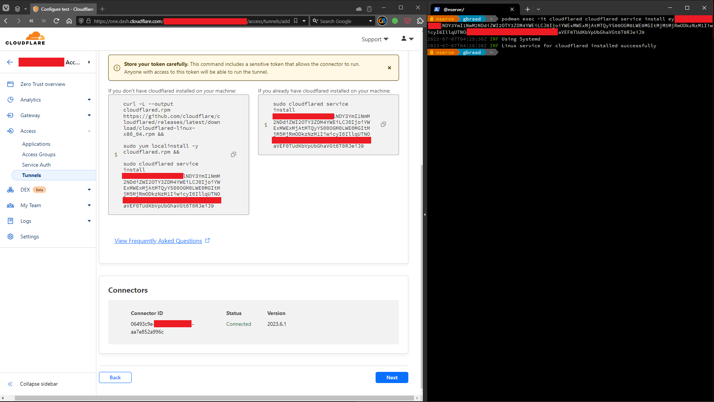

Cloudflared (system container)
==============================

System(d) container for use with Podman Machine, MicroShift, OpenShift Local and Podman Desktop installations, etc.




### Usage

#### Container creation
Start the system container. You can choose between the following options: [Debian](./#debian-based), [Fedora](./#fedora-based) or [RHEL UBI9](./#rhel-ubi9-based)

##### Debian-based
```
$ podman run -d --name=cloudflared \
        --hostname $HOSTNAME-cloudflared \
        --network=host --systemd=always \
        ghcr.io/spotsnel/cloudflared-systemd:latest
```

##### Fedora-based
```
$ podman run -d --name=cloudflared \
        --hostname $HOSTNAME-cloudflared \
        --network=host --systemd=always \
        ghcr.io/spotsnel/cloudflared-systemd/fedora:latest
```

##### RHEL UBI9-based
```
$ podman run -d --name=cloudflared \
        --hostname $HOSTNAME-cloudflared \
        --network=host --systemd=always \
        ghcr.io/spotsnel/cloudflared-systemd/ubi9:latest
```

#### Node registration
and register the tunnel
```
$ podman exec -it cloudflared cloudflared service install eyJhIjoiZWU5YTFlOTBlNDY3YmI1NmM2NDdiZWI2OTY3ZDM4YWEiLCJ0IjoiNzg0ZDA4NjAtZjExMy00ZjlhLTllYzctNTc4NTk3NzJkZmNjIiwicyI6Ill6azFObU5oWkdRdE9UTmlNaTAwTldWbExXSTNaV0V0T0RRNE9UazJOVGN6TlRNdyJ9
```

or use the Podman Desktop or Cockpit terminal to do so.

#### Systemd
The lifecycle of the container can be maintained by the host using a systemd service unit:

```
$ (cd $HOME/.config/systemd/user && podman generate systemd --name --files cloudflared 
$ systemctl --user enable --now container-cloudflared
$ loginctl enable-linger $USER
```
